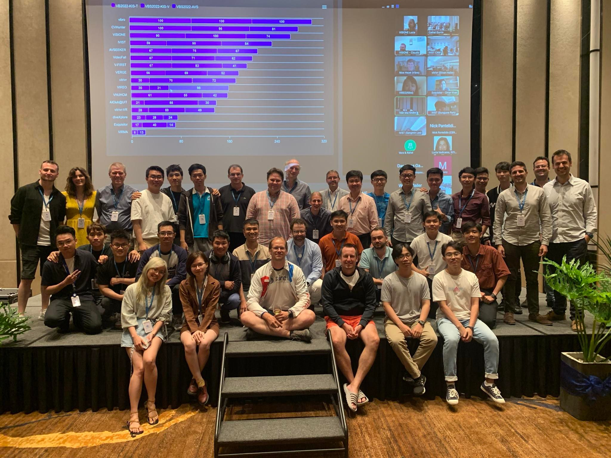
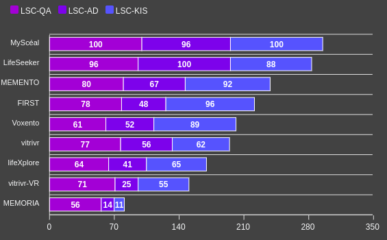

# FIRST Lifelog Retrieval Server

This is the repo containing the backend that was used by team FIRST/V-FIRST at LSC'22 and VBS 2022 respectively.

## Challenge results

### VBS 2022

At VBS 2022, we placed 7/16, just a bit behind Best Newcomer VideoFall. We scored 67 on KIS-T, 83 on KIS-V, and 41 on AVS. This marks the return of our team since VBS 2018, and we did pretty well!

There were some difficult KIS-T tasks that require some advanced English, and/or creativity in parsing the queries and making use of different search terms.

We anticipated difficulties in KIS-V tasks, however text queries combined with visually similar image search work out quite well.

### LSC 2022

At LSC 2022, we placed 4/9, winning Best KIS (after overall winner MyScéal). This is a very proud result of our team! 

As our system is designed with KIS in mind, overall our system performs best within that category. QA is a new category that requires ancillary tools (e.g., a map). As with VBS, our inferior performance in AVS tasks is due to the lack of batch-submit related features, which we have improved for LSC'22 but not quite enough.

